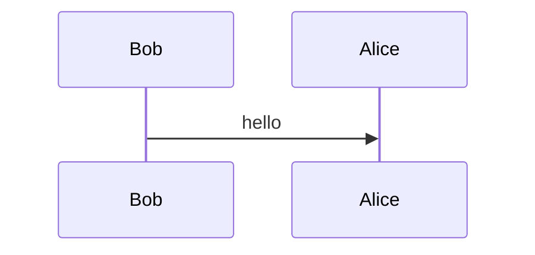
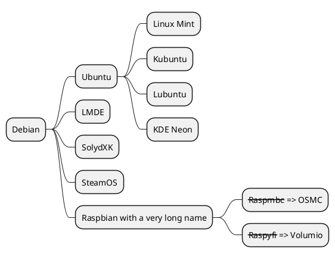

## Links
### Namespaces in the links
```
[text]​(namespace:value1|value2)
```

Examples:
- [Link to the code system **v3-ietf3066**](cs:v3-ietf3066)
- [Link to the value set **country**](vs:country)
- [Link to the SNOMED concept **Blood pressure**](concept:snomed-ct|75367002)
- [Link to **basic markdown page** in the same space](page:basic-markdown-syntax)
- [Link to **mammography page** in the another space](page:healthsense/mammography)


+++ Code
```
[Link to the code system **v3-ietf3066**](cs:v3-ietf3066)
[Link to the value set **country**](vs:country)
[Link to the SNOMED concept **Blood pressure**](concept:snomed-ct|75367002)
[Link to **basic markdown page** in the same space](page:basic-markdown-syntax)
[Link to **mammographyn page** in another space](page:healthsense/mammography)
```
+++

Supported namespaces:
- Links to the terminology
  - *cs* - code system
  - *vs* - value set
  - *ms* - mapset
  - *concept* - concept
- Link to Wiki
  - *page* - Wiki page

### Page Links 
- [Relative link](/spaces)
- [Absolute link](https://termx.kodality.dev/spaces)
- [Page in current Space](page:markdown-syntax)
- [Page from other Space](page:healthsense/mammography)

+++ Code
```
[Relative link](/spaces)
[Absolute link](https://termx.kodality.dev/spaces)
[Page in current Space](page:markdown-syntax)
[Page from other Space](page:healthsense/mammography)
```
+++

## Include
Include element to the page.
```
{{namespace:value}}
```
Alternatively you can provided properties to included element.
```
{{namespace:value; prop1=val1; prop2=val1,val2}}
```

Supported namespaces: 
- *def* - StructureDefinition
- *csc* - CodeSystem concepts
- *vsc* - ValueSet concepts

<br>

## {.tabset}
### StructureDefinition
{{def:WikiDemo; type=diff}}

Supported properties:
* `type` (diff, hybrid, snap)

### CodeSystem concepts
{{csc:orpha-flag-value|1.0.0; properties=display,code; langs=en}}

Supported properties:
* `properties` (code, CS entity properties)
  * Columns are rendered based on the order of the provided properties
* `langs`
* `limit`

The first column shows concept hierarchy with tabbed spacing based on the CS "Hierarchy meaning" field.

### ValueSet concepts
{{vsc:languages|5.0.0; properties=display,code; langs=en; limit=10}}


Supported properties:
* `properties` (code, display, designations)
* `langs`
* `limit`


## Draw.<span>io

```drawio
PD94bWwgdmVyc2lvbj0iMS4wIiBlbmNvZGluZz0iVVRGLTgiPz4KICAgICAgPCFET0NUWVBFIHN2ZyBQVUJMSUMgIi0vL1czQy8vRFREIFNWRyAxLjEvL0VOIiAiaHR0cDovL3d3dy53My5vcmcvR3JhcGhpY3MvU1ZHLzEuMS9EVEQvc3ZnMTEuZHRkIj4KICAgICAgPHN2ZyB4bWxucz0iaHR0cDovL3d3dy53My5vcmcvMjAwMC9zdmciIHhtbG5zOnhsaW5rPSJodHRwOi8vd3d3LnczLm9yZy8xOTk5L3hsaW5rIiB2ZXJzaW9uPSIxLjEiIHdpZHRoPSI1MXB4IiBoZWlnaHQ9Ijk4cHgiIHZpZXdCb3g9Ii0wLjUgLTAuNSA1MSA5OCIgY29udGVudD0iJmx0O214ZmlsZSBob3N0PSZxdW90O2VtYmVkLmRpYWdyYW1zLm5ldCZxdW90OyBtb2RpZmllZD0mcXVvdDsyMDIzLTEwLTE2VDEwOjIxOjU0LjA5MFomcXVvdDsgYWdlbnQ9JnF1b3Q7TW96aWxsYS81LjAgKE1hY2ludG9zaDsgSW50ZWwgTWFjIE9TIFggMTBfMTVfNykgQXBwbGVXZWJLaXQvNjA1LjEuMTUgKEtIVE1MLCBsaWtlIEdlY2tvKSBWZXJzaW9uLzE3LjAgU2FmYXJpLzYwNS4xLjE1JnF1b3Q7IGV0YWc9JnF1b3Q7Y0xFSlVyN0U2OEgtTkdVOUkzU00mcXVvdDsgdmVyc2lvbj0mcXVvdDsyMi4wLjQmcXVvdDsgdHlwZT0mcXVvdDtlbWJlZCZxdW90OyZndDsmbHQ7ZGlhZ3JhbSBpZD0mcXVvdDtjNDV0eUZiWU9fR1ZMNVdKb1BXRCZxdW90OyBuYW1lPSZxdW90O1BhZ2UtMSZxdW90OyZndDtqWkpOYjRNd0RJWi9EWGNnRysyT0hldTZ3eVpONm1IbkZEeUlsR0FVVElIOStvWEdmS21hdEZPY3g2OFRmd1VpTmYzSnlycjh3QngwRUlkNUg0aVhJSTZqOEhIdmpwRU1uaVJKNUVGaFZjNmlCWnpWRDB5UlRGdVZRN01SRXFJbVZXOWhobFVGR1cyWXRCYTdyZXdiOWZiWFdoWndCODZaMVBmMFMrVlVlcnFQZHd0L0ExV1UwODlSOHVROVJrNWlycVFwWlk3ZENvbGpJRktMU040eWZRcDZiTjdVRngvMytvZDNUc3hDUmY4SmlIM0FWZXFXYXp0a2hGWndkalJNSmJ0RTY5RnNqYjRwQXZGOEJVdktOZVZkWGtCL1lxTklZZVVrRnlSQ3N4SWN0Q3BHQjJIdGFFbEd1MHZrVEd4SnF3clNlVXloZy9jbGNGWGpjOUN2RUpkMEFqUkFkbkFTOXU2NHU3eGVEM3p0bGxrSlJ1VnFUQWt6eWR0UnpPOHVEWFFHOTNDNkxyTzYrVlliTDQ2LyZsdDsvZGlhZ3JhbSZndDsmbHQ7L214ZmlsZSZndDsiIHN0eWxlPSJiYWNrZ3JvdW5kLWNvbG9yOiByZ2IoMjU1LCAyNTUsIDI1NSk7Ij48ZGVmcy8+PGc+PGVsbGlwc2UgY3g9IjI1IiBjeT0iMTUuNSIgcng9IjcuNSIgcnk9IjcuNSIgZmlsbD0icmdiKDI1NSwgMjU1LCAyNTUpIiBzdHJva2U9InJnYigwLCAwLCAwKSIgcG9pbnRlci1ldmVudHM9ImFsbCIvPjxwYXRoIGQ9Ik0gMjUgMjMgTCAyNSA0OCBNIDI1IDI4IEwgMTAgMjggTSAyNSAyOCBMIDQwIDI4IE0gMjUgNDggTCAxMCA2OCBNIDI1IDQ4IEwgNDAgNjgiIGZpbGw9Im5vbmUiIHN0cm9rZT0icmdiKDAsIDAsIDApIiBzdHJva2UtbWl0ZXJsaW1pdD0iMTAiIHBvaW50ZXItZXZlbnRzPSJhbGwiLz48ZyB0cmFuc2Zvcm09InRyYW5zbGF0ZSgtMC41IC0wLjUpIj48c3dpdGNoPjxmb3JlaWduT2JqZWN0IHBvaW50ZXItZXZlbnRzPSJub25lIiB3aWR0aD0iMTAwJSIgaGVpZ2h0PSIxMDAlIiByZXF1aXJlZEZlYXR1cmVzPSJodHRwOi8vd3d3LnczLm9yZy9UUi9TVkcxMS9mZWF0dXJlI0V4dGVuc2liaWxpdHkiIHN0eWxlPSJvdmVyZmxvdzogdmlzaWJsZTsgdGV4dC1hbGlnbjogbGVmdDsiPjxkaXYgeG1sbnM9Imh0dHA6Ly93d3cudzMub3JnLzE5OTkveGh0bWwiIHN0eWxlPSJkaXNwbGF5OiBmbGV4OyBhbGlnbi1pdGVtczogdW5zYWZlIGZsZXgtc3RhcnQ7IGp1c3RpZnktY29udGVudDogdW5zYWZlIGNlbnRlcjsgd2lkdGg6IDFweDsgaGVpZ2h0OiAxcHg7IHBhZGRpbmctdG9wOiA3NXB4OyBtYXJnaW4tbGVmdDogMjVweDsiPjxkaXYgZGF0YS1kcmF3aW8tY29sb3JzPSJjb2xvcjogcmdiKDAsIDAsIDApOyAiIHN0eWxlPSJib3gtc2l6aW5nOiBib3JkZXItYm94OyBmb250LXNpemU6IDBweDsgdGV4dC1hbGlnbjogY2VudGVyOyI+PGRpdiBzdHlsZT0iZGlzcGxheTogaW5saW5lLWJsb2NrOyBmb250LXNpemU6IDEycHg7IGZvbnQtZmFtaWx5OiBIZWx2ZXRpY2E7IGNvbG9yOiByZ2IoMCwgMCwgMCk7IGxpbmUtaGVpZ2h0OiAxLjI7IHBvaW50ZXItZXZlbnRzOiBhbGw7IHdoaXRlLXNwYWNlOiBub3dyYXA7Ij5BY3RvcjM8L2Rpdj48L2Rpdj48L2Rpdj48L2ZvcmVpZ25PYmplY3Q+PHRleHQgeD0iMjUiIHk9Ijg3IiBmaWxsPSJyZ2IoMCwgMCwgMCkiIGZvbnQtZmFtaWx5PSJIZWx2ZXRpY2EiIGZvbnQtc2l6ZT0iMTJweCIgdGV4dC1hbmNob3I9Im1pZGRsZSI+QWN0b3IzPC90ZXh0Pjwvc3dpdGNoPjwvZz48L2c+PHN3aXRjaD48ZyByZXF1aXJlZEZlYXR1cmVzPSJodHRwOi8vd3d3LnczLm9yZy9UUi9TVkcxMS9mZWF0dXJlI0V4dGVuc2liaWxpdHkiLz48YSB0cmFuc2Zvcm09InRyYW5zbGF0ZSgwLC01KSIgeGxpbms6aHJlZj0iaHR0cHM6Ly93d3cuZHJhd2lvLmNvbS9kb2MvZmFxL3N2Zy1leHBvcnQtdGV4dC1wcm9ibGVtcyIgdGFyZ2V0PSJfYmxhbmsiPjx0ZXh0IHRleHQtYW5jaG9yPSJtaWRkbGUiIGZvbnQtc2l6ZT0iMTBweCIgeD0iNTAlIiB5PSIxMDAlIj5UZXh0IGlzIG5vdCBTVkcgLSBjYW5ub3QgZGlzcGxheTwvdGV4dD48L2E+PC9zd2l0Y2g+PC9zdmc+
```

> The "Diagrams" icon in the left panel of the markdown editor opens the built-in Draw.io editor. After closing of the editor the binary representation of SVG image will be stored in the wiki page. Navigate to the content and click "Diagrams" again for editing of existing drawing.
{.is-info}


## Charting Tools

### Mermaid


+++ Code
~~~

~~~
+++

### PlantUML 
#### Sequence Diagram
```plantuml
Bob->Alice : Hello
Bob <-- Alice: Hello. Please visit https://plantuml.com/
```

+++ Code
~~~
```plantuml
Bob->Alice : Hello
Bob <-- Alice: Hello. Please visit https://plantuml.com/
```
~~~
+++

#### MindMap


+++ Code
~~~

~~~
+++
