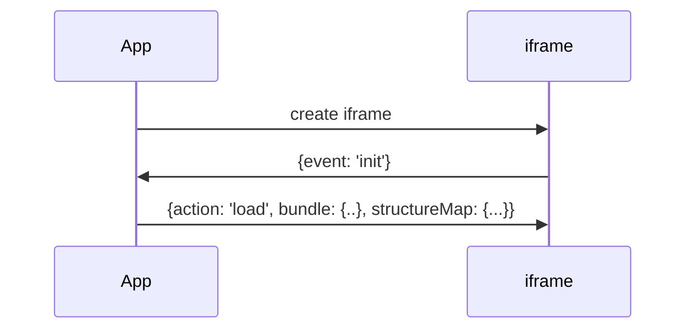
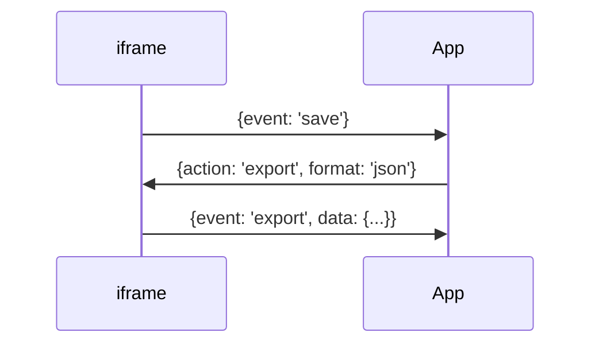

The FML Editor is a self-hosted web JavaScript application, providing a structured API for embedding within your application.


## Running inside an iframe[^1]

[^1]: https://gitlab.com/kodality/terminology/termx-fml

To run the FML editor within your application, follow these steps:

1. Create an iframe element within your application.
2. Provide the URL to the FML editor to the iframe.
3. Establish communication between the iframe and your application using [window.postMessage()](https://developer.mozilla.org/en-US/docs/Web/API/Window/postMessage).

### Initialization

The editor within the iframe will send an `init` event when it's ready to proceed with further actions.

To initialize the FML editor, the client should supply the `bundle`, `structure map` and optionally, `contained resources` using the `load`[^2] action.
[^2]: https://gitlab.com/kodality/terminology/termx-fml/-/blob/main/src/app/context/iframe.context.ts#L10




### Saving
The `save` event is triggered when the user clicks on the 'Save' button in the FML editor.

To save data, the client should send the `export` action.

Optionally, the save format can be provided:
* `json` - composes FHIR StructureMap object
* `json+svg` - `json` + snapshot of the main group as svg in the StructureMap extension

Once the data is prepared and ready for export, the FML editor sends the `export` event with a StructureMap object as data.




## TermX intergration

The diagram below illustrates the communication flow between the FML Editor and the TermX application.

```drawio
PD94bWwgdmVyc2lvbj0iMS4wIiBlbmNvZGluZz0iVVRGLTgiPz4KICAgICAgPCFET0NUWVBFIHN2ZyBQVUJMSUMgIi0vL1czQy8vRFREIFNWRyAxLjEvL0VOIiAiaHR0cDovL3d3dy53My5vcmcvR3JhcGhpY3MvU1ZHLzEuMS9EVEQvc3ZnMTEuZHRkIj4KICAgICAgPHN2ZyB4bWxucz0iaHR0cDovL3d3dy53My5vcmcvMjAwMC9zdmciIHhtbG5zOnhsaW5rPSJodHRwOi8vd3d3LnczLm9yZy8xOTk5L3hsaW5rIiB2ZXJzaW9uPSIxLjEiIHdpZHRoPSI2MDZweCIgaGVpZ2h0PSI0MDdweCIgdmlld0JveD0iLTAuNSAtMC41IDYwNiA0MDciIGNvbnRlbnQ9IiZsdDtteGZpbGUgaG9zdD0mcXVvdDtlbWJlZC5kaWFncmFtcy5uZXQmcXVvdDsgbW9kaWZpZWQ9JnF1b3Q7MjAyMy0wOC0yMlQxMzoxMzo0My4wMjNaJnF1b3Q7IGFnZW50PSZxdW90O01vemlsbGEvNS4wIChYMTE7IExpbnV4IHg4Nl82NCkgQXBwbGVXZWJLaXQvNTM3LjM2IChLSFRNTCwgbGlrZSBHZWNrbykgQ2hyb21lLzExMi4wLjAuMCBTYWZhcmkvNTM3LjM2JnF1b3Q7IGV0YWc9JnF1b3Q7S0xCMjY5RUJveGZhdDhmUTBiZTkmcXVvdDsgdmVyc2lvbj0mcXVvdDsyMS42LjgmcXVvdDsgdHlwZT0mcXVvdDtlbWJlZCZxdW90OyZndDsmbHQ7ZGlhZ3JhbSBpZD0mcXVvdDtwbTBjcUJGaC0zMGZ3eXZaeUpOdiZxdW90OyBuYW1lPSZxdW90O1BhZ2UtMSZxdW90OyZndDs3VnBOVTlzd0VQMDFIbTZNWllkOEhFTUl0RE13MHhrT1BTdldPbEdSTFkrc2ZNQ3ZyMlRMc1JVYkNLMUMwdEFMWTYra2xmemU3bHRKd1FzbnllWk80R3p4d0Frd0wvREp4Z3R2dkNEb2o1RDZxdzNQcGFIbmowckRYRkJTbWxCdGVLUXZZSXkrc1M0cGdkenFLRGxua21hMk1lSnBDcEcwYkZnSXZyYTd4WnpaczJaNERpM0RZNFJaMi9xVEVya29yY05nVU51L0FaMHZxcGxSMzN4Zmdxdk81a3Z5QlNaODNUQ0ZVeStjQ001bCtaUnNKc0EwZGhVdTViamJWMXEzQ3hPUXluMEdCT1dBRldaTDgyMW1YZks1K2xoSXlWaGpwdDVTbmlyajlVSW1UTDBoOVNqNE1pV2duZm5xclQyN1dSQVFDMUN6bGp2Z0NVanhyRHFzYXhpdkREU0xCb0tWVFFERGtxNXNHckJoYzc1MXQ1M2hCNmRxSllHL3FlS3NITEVOTzkvMmtQT2xpTUFNYXFMMm5oL2JqY1JpRHJMbFJqMDB2cmsyRlpSMDB4TitMWHFHcnZocE9Ub1VRUWg5aUtHSTRUeW4wV0ZJY3BzY0NEa0NIeDBRL1E3NUdsempTRktlZXVGWXRWd3dqc21GRnloWC9rekJyRG5SZHRYdDh0SWIzSlF0dVJUTFNDNEZQT0JzcDMxdzArWlRFWEdQWjZxa0tlNGdweTk0VmpUNU5xMlkwWG1xT1ZkRWdsQ0dGUWhKVlJFWm00YUVrbUk5WFpUYkJjeE1VSmNON1FvMmJxTEJ3djhOc0FldUl6Mm1qRTA0NDZJWUhCSU13MWdQVUd6d0oyaTA5S01oek9LajVzWk9UQS9kRkk1V2pybExqV0ZYWnNDcUFLNUlESnBTZVhHazhCNmNYblQzemxYSHJ4ekorRzdJdXd2VnF4YjBrUUFzUVhlSkJVN2dHQ0hhTzcwUVJmOFZ1QTVIVnhJY0hrNkMwYnNhREp1TUMybTJKd1JMZkJxYmp4T1VaOVFXaVRQUloyY0NmVUNGUnYydVNMYjIyVllveDF3a3VBcnlYemxQajdYUnFNTG1sRUk1Y0g1ay9JZGxQT3c3a3ZIUndZSy9vdWN0R2Yrc3JUVFR6bFRpUGMyTENLaW9KUkRqSlpPZHhBWW5lSlRzdU5mNnJvNGpWQUh4Z2d0UjJVVlNMVkhhb05uQmJhNittcGxnVFB1RHUxNVFDWThaanZTY2E2R3ZBdmF0R1h1QStFb0NWT3JmdUdGREZUWE5LN2JkK1A2akl2cXg2OFR6VnA1dEF2eWw4clRxdDhPeTIzRW90WlVueHlzNFdtME5UMUJZMmh1Vlc4cjBTVklqOVhWVVpVdkNaOGhLeDEzVFZGWEVyNFAyZGhQekh0cWhDN1JITGJUSFdYYStZQ01iYTlTR3VuOGdwQ3NmVFRGNXVGZUdLYUZTSVhhMmtQZDJyNm5ibUEvZFlLNWU2OSs2eXdwWi84TkFPUDBOJmx0Oy9kaWFncmFtJmd0OyZsdDsvbXhmaWxlJmd0OyIgc3R5bGU9ImJhY2tncm91bmQtY29sb3I6IHJnYigyNTUsIDI1NSwgMjU1KTsiPjxkZWZzLz48Zz48cGF0aCBkPSJNIDM4IDM5OCBMIDM4IDM4IiBmaWxsPSJub25lIiBzdHJva2U9InJnYigwLCAwLCAwKSIgc3Ryb2tlLW1pdGVybGltaXQ9IjEwIiBwb2ludGVyLWV2ZW50cz0ic3Ryb2tlIi8+PHBhdGggZD0iTSA0NzggMzk4IEwgNDc4IDM4IiBmaWxsPSJub25lIiBzdHJva2U9InJnYigwLCAwLCAwKSIgc3Ryb2tlLW1pdGVybGltaXQ9IjEwIiBwb2ludGVyLWV2ZW50cz0ic3Ryb2tlIi8+PHBhdGggZD0iTSAzOCAxMDggTCA0NzEuNjUgMTM3LjU3IiBmaWxsPSJub25lIiBzdHJva2U9InJnYigwLCAwLCAwKSIgc3Ryb2tlLW1pdGVybGltaXQ9IjEwIiBwb2ludGVyLWV2ZW50cz0ic3Ryb2tlIi8+PHBhdGggZD0iTSA0NzYuODggMTM3LjkyIEwgNDY5LjY2IDE0MC45NCBMIDQ3MS42NSAxMzcuNTcgTCA0NzAuMTQgMTMzLjk2IFoiIGZpbGw9InJnYigwLCAwLCAwKSIgc3Ryb2tlPSJyZ2IoMCwgMCwgMCkiIHN0cm9rZS1taXRlcmxpbWl0PSIxMCIgcG9pbnRlci1ldmVudHM9ImFsbCIvPjxnIHRyYW5zZm9ybT0idHJhbnNsYXRlKC0wLjUgLTAuNSkiPjxzd2l0Y2g+PGZvcmVpZ25PYmplY3QgcG9pbnRlci1ldmVudHM9Im5vbmUiIHdpZHRoPSIxMDAlIiBoZWlnaHQ9IjEwMCUiIHJlcXVpcmVkRmVhdHVyZXM9Imh0dHA6Ly93d3cudzMub3JnL1RSL1NWRzExL2ZlYXR1cmUjRXh0ZW5zaWJpbGl0eSIgc3R5bGU9Im92ZXJmbG93OiB2aXNpYmxlOyB0ZXh0LWFsaWduOiBsZWZ0OyI+PGRpdiB4bWxucz0iaHR0cDovL3d3dy53My5vcmcvMTk5OS94aHRtbCIgc3R5bGU9ImRpc3BsYXk6IGZsZXg7IGFsaWduLWl0ZW1zOiB1bnNhZmUgY2VudGVyOyBqdXN0aWZ5LWNvbnRlbnQ6IHVuc2FmZSBjZW50ZXI7IHdpZHRoOiAxcHg7IGhlaWdodDogMXB4OyBwYWRkaW5nLXRvcDogMTIzcHg7IG1hcmdpbi1sZWZ0OiAyNThweDsiPjxkaXYgZGF0YS1kcmF3aW8tY29sb3JzPSJjb2xvcjogcmdiKDAsIDAsIDApOyBiYWNrZ3JvdW5kLWNvbG9yOiByZ2IoMjU1LCAyNTUsIDI1NSk7ICIgc3R5bGU9ImJveC1zaXppbmc6IGJvcmRlci1ib3g7IGZvbnQtc2l6ZTogMHB4OyB0ZXh0LWFsaWduOiBjZW50ZXI7Ij48ZGl2IHN0eWxlPSJkaXNwbGF5OiBpbmxpbmUtYmxvY2s7IGZvbnQtc2l6ZTogMTFweDsgZm9udC1mYW1pbHk6IEhlbHZldGljYTsgY29sb3I6IHJnYigwLCAwLCAwKTsgbGluZS1oZWlnaHQ6IDEuMjsgcG9pbnRlci1ldmVudHM6IGFsbDsgYmFja2dyb3VuZC1jb2xvcjogcmdiKDI1NSwgMjU1LCAyNTUpOyB3aGl0ZS1zcGFjZTogbm93cmFwOyI+e2FjdGlvbjogJ2xvYWQnLCBidW5kbGU6IHsuLn0sIHN0cnVjdHVyZU1hcDogey4ufX08L2Rpdj48L2Rpdj48L2Rpdj48L2ZvcmVpZ25PYmplY3Q+PHRleHQgeD0iMjU4IiB5PSIxMjYiIGZpbGw9InJnYigwLCAwLCAwKSIgZm9udC1mYW1pbHk9IkhlbHZldGljYSIgZm9udC1zaXplPSIxMXB4IiB0ZXh0LWFuY2hvcj0ibWlkZGxlIj57YWN0aW9uOiAnbG9hZCcsIGJ1bmRsZTogey4ufSwgc3RydWN0dXJlTWFwOiB7Li59fTwvdGV4dD48L3N3aXRjaD48L2c+PHBhdGggZD0iTSA0NzggNzggTCA0NC4zNSAxMDcuNTciIGZpbGw9Im5vbmUiIHN0cm9rZT0iIzZjOGViZiIgc3Ryb2tlLW1pdGVybGltaXQ9IjEwIiBwb2ludGVyLWV2ZW50cz0ic3Ryb2tlIi8+PHBhdGggZD0iTSAzOS4xMiAxMDcuOTIgTCA0NS44NiAxMDMuOTYgTCA0NC4zNSAxMDcuNTcgTCA0Ni4zNCAxMTAuOTQgWiIgZmlsbD0iIzZjOGViZiIgc3Ryb2tlPSIjNmM4ZWJmIiBzdHJva2UtbWl0ZXJsaW1pdD0iMTAiIHBvaW50ZXItZXZlbnRzPSJhbGwiLz48ZyB0cmFuc2Zvcm09InRyYW5zbGF0ZSgtMC41IC0wLjUpIj48c3dpdGNoPjxmb3JlaWduT2JqZWN0IHBvaW50ZXItZXZlbnRzPSJub25lIiB3aWR0aD0iMTAwJSIgaGVpZ2h0PSIxMDAlIiByZXF1aXJlZEZlYXR1cmVzPSJodHRwOi8vd3d3LnczLm9yZy9UUi9TVkcxMS9mZWF0dXJlI0V4dGVuc2liaWxpdHkiIHN0eWxlPSJvdmVyZmxvdzogdmlzaWJsZTsgdGV4dC1hbGlnbjogbGVmdDsiPjxkaXYgeG1sbnM9Imh0dHA6Ly93d3cudzMub3JnLzE5OTkveGh0bWwiIHN0eWxlPSJkaXNwbGF5OiBmbGV4OyBhbGlnbi1pdGVtczogdW5zYWZlIGNlbnRlcjsganVzdGlmeS1jb250ZW50OiB1bnNhZmUgY2VudGVyOyB3aWR0aDogMXB4OyBoZWlnaHQ6IDFweDsgcGFkZGluZy10b3A6IDkzcHg7IG1hcmdpbi1sZWZ0OiAyNThweDsiPjxkaXYgZGF0YS1kcmF3aW8tY29sb3JzPSJjb2xvcjogcmdiKDAsIDAsIDApOyBiYWNrZ3JvdW5kLWNvbG9yOiByZ2IoMjU1LCAyNTUsIDI1NSk7ICIgc3R5bGU9ImJveC1zaXppbmc6IGJvcmRlci1ib3g7IGZvbnQtc2l6ZTogMHB4OyB0ZXh0LWFsaWduOiBjZW50ZXI7Ij48ZGl2IHN0eWxlPSJkaXNwbGF5OiBpbmxpbmUtYmxvY2s7IGZvbnQtc2l6ZTogMTFweDsgZm9udC1mYW1pbHk6IEhlbHZldGljYTsgY29sb3I6IHJnYigwLCAwLCAwKTsgbGluZS1oZWlnaHQ6IDEuMjsgcG9pbnRlci1ldmVudHM6IGFsbDsgYmFja2dyb3VuZC1jb2xvcjogcmdiKDI1NSwgMjU1LCAyNTUpOyB3aGl0ZS1zcGFjZTogbm93cmFwOyI+e2V2ZW50OiAnaW5pdCd9PC9kaXY+PC9kaXY+PC9kaXY+PC9mb3JlaWduT2JqZWN0Pjx0ZXh0IHg9IjI1OCIgeT0iOTYiIGZpbGw9InJnYigwLCAwLCAwKSIgZm9udC1mYW1pbHk9IkhlbHZldGljYSIgZm9udC1zaXplPSIxMXB4IiB0ZXh0LWFuY2hvcj0ibWlkZGxlIj57ZXZlbnQ6ICdpbml0J308L3RleHQ+PC9zd2l0Y2g+PC9nPjxwYXRoIGQ9Ik0gMzggNDggTCA0NzEuNjUgNzcuNTciIGZpbGw9Im5vbmUiIHN0cm9rZT0icmdiKDAsIDAsIDApIiBzdHJva2UtbWl0ZXJsaW1pdD0iMTAiIHBvaW50ZXItZXZlbnRzPSJzdHJva2UiLz48cGF0aCBkPSJNIDQ3Ni44OCA3Ny45MiBMIDQ2OS42NiA4MC45NCBMIDQ3MS42NSA3Ny41NyBMIDQ3MC4xNCA3My45NiBaIiBmaWxsPSJyZ2IoMCwgMCwgMCkiIHN0cm9rZT0icmdiKDAsIDAsIDApIiBzdHJva2UtbWl0ZXJsaW1pdD0iMTAiIHBvaW50ZXItZXZlbnRzPSJhbGwiLz48ZyB0cmFuc2Zvcm09InRyYW5zbGF0ZSgtMC41IC0wLjUpIj48c3dpdGNoPjxmb3JlaWduT2JqZWN0IHBvaW50ZXItZXZlbnRzPSJub25lIiB3aWR0aD0iMTAwJSIgaGVpZ2h0PSIxMDAlIiByZXF1aXJlZEZlYXR1cmVzPSJodHRwOi8vd3d3LnczLm9yZy9UUi9TVkcxMS9mZWF0dXJlI0V4dGVuc2liaWxpdHkiIHN0eWxlPSJvdmVyZmxvdzogdmlzaWJsZTsgdGV4dC1hbGlnbjogbGVmdDsiPjxkaXYgeG1sbnM9Imh0dHA6Ly93d3cudzMub3JnLzE5OTkveGh0bWwiIHN0eWxlPSJkaXNwbGF5OiBmbGV4OyBhbGlnbi1pdGVtczogdW5zYWZlIGNlbnRlcjsganVzdGlmeS1jb250ZW50OiB1bnNhZmUgY2VudGVyOyB3aWR0aDogMXB4OyBoZWlnaHQ6IDFweDsgcGFkZGluZy10b3A6IDYzcHg7IG1hcmdpbi1sZWZ0OiAyNThweDsiPjxkaXYgZGF0YS1kcmF3aW8tY29sb3JzPSJjb2xvcjogcmdiKDAsIDAsIDApOyBiYWNrZ3JvdW5kLWNvbG9yOiByZ2IoMjU1LCAyNTUsIDI1NSk7ICIgc3R5bGU9ImJveC1zaXppbmc6IGJvcmRlci1ib3g7IGZvbnQtc2l6ZTogMHB4OyB0ZXh0LWFsaWduOiBjZW50ZXI7Ij48ZGl2IHN0eWxlPSJkaXNwbGF5OiBpbmxpbmUtYmxvY2s7IGZvbnQtc2l6ZTogMTFweDsgZm9udC1mYW1pbHk6IEhlbHZldGljYTsgY29sb3I6IHJnYigwLCAwLCAwKTsgbGluZS1oZWlnaHQ6IDEuMjsgcG9pbnRlci1ldmVudHM6IGFsbDsgYmFja2dyb3VuZC1jb2xvcjogcmdiKDI1NSwgMjU1LCAyNTUpOyB3aGl0ZS1zcGFjZTogbm93cmFwOyI+Y3JlYXRlIGlmcmFtZTwvZGl2PjwvZGl2PjwvZGl2PjwvZm9yZWlnbk9iamVjdD48dGV4dCB4PSIyNTgiIHk9IjY2IiBmaWxsPSJyZ2IoMCwgMCwgMCkiIGZvbnQtZmFtaWx5PSJIZWx2ZXRpY2EiIGZvbnQtc2l6ZT0iMTFweCIgdGV4dC1hbmNob3I9Im1pZGRsZSI+Y3JlYXRlIGlmcmFtZTwvdGV4dD48L3N3aXRjaD48L2c+PHBhdGggZD0iTSA0NzggMjc4IEwgNDQuMzUgMzA3LjU3IiBmaWxsPSJub25lIiBzdHJva2U9IiM2YzhlYmYiIHN0cm9rZS1taXRlcmxpbWl0PSIxMCIgcG9pbnRlci1ldmVudHM9InN0cm9rZSIvPjxwYXRoIGQ9Ik0gMzkuMTIgMzA3LjkyIEwgNDUuODYgMzAzLjk2IEwgNDQuMzUgMzA3LjU3IEwgNDYuMzQgMzEwLjk0IFoiIGZpbGw9IiM2YzhlYmYiIHN0cm9rZT0iIzZjOGViZiIgc3Ryb2tlLW1pdGVybGltaXQ9IjEwIiBwb2ludGVyLWV2ZW50cz0iYWxsIi8+PGcgdHJhbnNmb3JtPSJ0cmFuc2xhdGUoLTAuNSAtMC41KSI+PHN3aXRjaD48Zm9yZWlnbk9iamVjdCBwb2ludGVyLWV2ZW50cz0ibm9uZSIgd2lkdGg9IjEwMCUiIGhlaWdodD0iMTAwJSIgcmVxdWlyZWRGZWF0dXJlcz0iaHR0cDovL3d3dy53My5vcmcvVFIvU1ZHMTEvZmVhdHVyZSNFeHRlbnNpYmlsaXR5IiBzdHlsZT0ib3ZlcmZsb3c6IHZpc2libGU7IHRleHQtYWxpZ246IGxlZnQ7Ij48ZGl2IHhtbG5zPSJodHRwOi8vd3d3LnczLm9yZy8xOTk5L3hodG1sIiBzdHlsZT0iZGlzcGxheTogZmxleDsgYWxpZ24taXRlbXM6IHVuc2FmZSBjZW50ZXI7IGp1c3RpZnktY29udGVudDogdW5zYWZlIGNlbnRlcjsgd2lkdGg6IDFweDsgaGVpZ2h0OiAxcHg7IHBhZGRpbmctdG9wOiAyOTNweDsgbWFyZ2luLWxlZnQ6IDI1OHB4OyI+PGRpdiBkYXRhLWRyYXdpby1jb2xvcnM9ImNvbG9yOiByZ2IoMCwgMCwgMCk7IGJhY2tncm91bmQtY29sb3I6IHJnYigyNTUsIDI1NSwgMjU1KTsgIiBzdHlsZT0iYm94LXNpemluZzogYm9yZGVyLWJveDsgZm9udC1zaXplOiAwcHg7IHRleHQtYWxpZ246IGNlbnRlcjsiPjxkaXYgc3R5bGU9ImRpc3BsYXk6IGlubGluZS1ibG9jazsgZm9udC1zaXplOiAxMXB4OyBmb250LWZhbWlseTogSGVsdmV0aWNhOyBjb2xvcjogcmdiKDAsIDAsIDApOyBsaW5lLWhlaWdodDogMS4yOyBwb2ludGVyLWV2ZW50czogYWxsOyBiYWNrZ3JvdW5kLWNvbG9yOiByZ2IoMjU1LCAyNTUsIDI1NSk7IHdoaXRlLXNwYWNlOiBub3dyYXA7Ij57ZXZlbnQ6ICdleHBvcnQnLCBkYXRhOiB7Li59fTwvZGl2PjwvZGl2PjwvZGl2PjwvZm9yZWlnbk9iamVjdD48dGV4dCB4PSIyNTgiIHk9IjI5NiIgZmlsbD0icmdiKDAsIDAsIDApIiBmb250LWZhbWlseT0iSGVsdmV0aWNhIiBmb250LXNpemU9IjExcHgiIHRleHQtYW5jaG9yPSJtaWRkbGUiPntldmVudDogJ2V4cG9ydCcsIGRhdGE6IHsuLn19PC90ZXh0Pjwvc3dpdGNoPjwvZz48cGF0aCBkPSJNIDM4IDI0OCBMIDQ3MS42NSAyNzcuNTciIGZpbGw9Im5vbmUiIHN0cm9rZT0icmdiKDAsIDAsIDApIiBzdHJva2UtbWl0ZXJsaW1pdD0iMTAiIHBvaW50ZXItZXZlbnRzPSJzdHJva2UiLz48cGF0aCBkPSJNIDQ3Ni44OCAyNzcuOTIgTCA0NjkuNjYgMjgwLjk0IEwgNDcxLjY1IDI3Ny41NyBMIDQ3MC4xNCAyNzMuOTYgWiIgZmlsbD0icmdiKDAsIDAsIDApIiBzdHJva2U9InJnYigwLCAwLCAwKSIgc3Ryb2tlLW1pdGVybGltaXQ9IjEwIiBwb2ludGVyLWV2ZW50cz0iYWxsIi8+PGcgdHJhbnNmb3JtPSJ0cmFuc2xhdGUoLTAuNSAtMC41KSI+PHN3aXRjaD48Zm9yZWlnbk9iamVjdCBwb2ludGVyLWV2ZW50cz0ibm9uZSIgd2lkdGg9IjEwMCUiIGhlaWdodD0iMTAwJSIgcmVxdWlyZWRGZWF0dXJlcz0iaHR0cDovL3d3dy53My5vcmcvVFIvU1ZHMTEvZmVhdHVyZSNFeHRlbnNpYmlsaXR5IiBzdHlsZT0ib3ZlcmZsb3c6IHZpc2libGU7IHRleHQtYWxpZ246IGxlZnQ7Ij48ZGl2IHhtbG5zPSJodHRwOi8vd3d3LnczLm9yZy8xOTk5L3hodG1sIiBzdHlsZT0iZGlzcGxheTogZmxleDsgYWxpZ24taXRlbXM6IHVuc2FmZSBjZW50ZXI7IGp1c3RpZnktY29udGVudDogdW5zYWZlIGNlbnRlcjsgd2lkdGg6IDFweDsgaGVpZ2h0OiAxcHg7IHBhZGRpbmctdG9wOiAyNjNweDsgbWFyZ2luLWxlZnQ6IDI1OHB4OyI+PGRpdiBkYXRhLWRyYXdpby1jb2xvcnM9ImNvbG9yOiByZ2IoMCwgMCwgMCk7IGJhY2tncm91bmQtY29sb3I6IHJnYigyNTUsIDI1NSwgMjU1KTsgIiBzdHlsZT0iYm94LXNpemluZzogYm9yZGVyLWJveDsgZm9udC1zaXplOiAwcHg7IHRleHQtYWxpZ246IGNlbnRlcjsiPjxkaXYgc3R5bGU9ImRpc3BsYXk6IGlubGluZS1ibG9jazsgZm9udC1zaXplOiAxMXB4OyBmb250LWZhbWlseTogSGVsdmV0aWNhOyBjb2xvcjogcmdiKDAsIDAsIDApOyBsaW5lLWhlaWdodDogMS4yOyBwb2ludGVyLWV2ZW50czogYWxsOyBiYWNrZ3JvdW5kLWNvbG9yOiByZ2IoMjU1LCAyNTUsIDI1NSk7IHdoaXRlLXNwYWNlOiBub3dyYXA7Ij57YWN0aW9uOiAnZXhwb3J0JywgZm9ybWF0OiAnanNvbid9PC9kaXY+PC9kaXY+PC9kaXY+PC9mb3JlaWduT2JqZWN0Pjx0ZXh0IHg9IjI1OCIgeT0iMjY2IiBmaWxsPSJyZ2IoMCwgMCwgMCkiIGZvbnQtZmFtaWx5PSJIZWx2ZXRpY2EiIGZvbnQtc2l6ZT0iMTFweCIgdGV4dC1hbmNob3I9Im1pZGRsZSI+e2FjdGlvbjogJ2V4cG9ydCcsIGZvcm1hdDogJ2pzb24nfTwvdGV4dD48L3N3aXRjaD48L2c+PHBhdGggZD0iTSA0NzggMzU4IEwgNDQuMzUgMzg3LjU3IiBmaWxsPSJub25lIiBzdHJva2U9IiM2YzhlYmYiIHN0cm9rZS1taXRlcmxpbWl0PSIxMCIgcG9pbnRlci1ldmVudHM9InN0cm9rZSIvPjxwYXRoIGQ9Ik0gMzkuMTIgMzg3LjkyIEwgNDUuODYgMzgzLjk2IEwgNDQuMzUgMzg3LjU3IEwgNDYuMzQgMzkwLjk0IFoiIGZpbGw9IiM2YzhlYmYiIHN0cm9rZT0iIzZjOGViZiIgc3Ryb2tlLW1pdGVybGltaXQ9IjEwIiBwb2ludGVyLWV2ZW50cz0iYWxsIi8+PGcgdHJhbnNmb3JtPSJ0cmFuc2xhdGUoLTAuNSAtMC41KSI+PHN3aXRjaD48Zm9yZWlnbk9iamVjdCBwb2ludGVyLWV2ZW50cz0ibm9uZSIgd2lkdGg9IjEwMCUiIGhlaWdodD0iMTAwJSIgcmVxdWlyZWRGZWF0dXJlcz0iaHR0cDovL3d3dy53My5vcmcvVFIvU1ZHMTEvZmVhdHVyZSNFeHRlbnNpYmlsaXR5IiBzdHlsZT0ib3ZlcmZsb3c6IHZpc2libGU7IHRleHQtYWxpZ246IGxlZnQ7Ij48ZGl2IHhtbG5zPSJodHRwOi8vd3d3LnczLm9yZy8xOTk5L3hodG1sIiBzdHlsZT0iZGlzcGxheTogZmxleDsgYWxpZ24taXRlbXM6IHVuc2FmZSBjZW50ZXI7IGp1c3RpZnktY29udGVudDogdW5zYWZlIGNlbnRlcjsgd2lkdGg6IDFweDsgaGVpZ2h0OiAxcHg7IHBhZGRpbmctdG9wOiAzNzNweDsgbWFyZ2luLWxlZnQ6IDI1OHB4OyI+PGRpdiBkYXRhLWRyYXdpby1jb2xvcnM9ImNvbG9yOiByZ2IoMCwgMCwgMCk7IGJhY2tncm91bmQtY29sb3I6IHJnYigyNTUsIDI1NSwgMjU1KTsgIiBzdHlsZT0iYm94LXNpemluZzogYm9yZGVyLWJveDsgZm9udC1zaXplOiAwcHg7IHRleHQtYWxpZ246IGNlbnRlcjsiPjxkaXYgc3R5bGU9ImRpc3BsYXk6IGlubGluZS1ibG9jazsgZm9udC1zaXplOiAxMXB4OyBmb250LWZhbWlseTogSGVsdmV0aWNhOyBjb2xvcjogcmdiKDAsIDAsIDApOyBsaW5lLWhlaWdodDogMS4yOyBwb2ludGVyLWV2ZW50czogYWxsOyBiYWNrZ3JvdW5kLWNvbG9yOiByZ2IoMjU1LCAyNTUsIDI1NSk7IHdoaXRlLXNwYWNlOiBub3dyYXA7Ij57ZXZlbnQ6ICdleGl0J308L2Rpdj48L2Rpdj48L2Rpdj48L2ZvcmVpZ25PYmplY3Q+PHRleHQgeD0iMjU4IiB5PSIzNzYiIGZpbGw9InJnYigwLCAwLCAwKSIgZm9udC1mYW1pbHk9IkhlbHZldGljYSIgZm9udC1zaXplPSIxMXB4IiB0ZXh0LWFuY2hvcj0ibWlkZGxlIj57ZXZlbnQ6ICdleGl0J308L3RleHQ+PC9zd2l0Y2g+PC9nPjxyZWN0IHg9IjQ3OCIgeT0iNDgiIHdpZHRoPSIxMjAiIGhlaWdodD0iOTAiIGZpbGw9Im5vbmUiIHN0cm9rZT0ibm9uZSIgcG9pbnRlci1ldmVudHM9ImFsbCIvPjxnIHRyYW5zZm9ybT0idHJhbnNsYXRlKC0wLjUgLTAuNSkiPjxzd2l0Y2g+PGZvcmVpZ25PYmplY3QgcG9pbnRlci1ldmVudHM9Im5vbmUiIHdpZHRoPSIxMDAlIiBoZWlnaHQ9IjEwMCUiIHJlcXVpcmVkRmVhdHVyZXM9Imh0dHA6Ly93d3cudzMub3JnL1RSL1NWRzExL2ZlYXR1cmUjRXh0ZW5zaWJpbGl0eSIgc3R5bGU9Im92ZXJmbG93OiB2aXNpYmxlOyB0ZXh0LWFsaWduOiBsZWZ0OyI+PGRpdiB4bWxucz0iaHR0cDovL3d3dy53My5vcmcvMTk5OS94aHRtbCIgc3R5bGU9ImRpc3BsYXk6IGZsZXg7IGFsaWduLWl0ZW1zOiB1bnNhZmUgY2VudGVyOyBqdXN0aWZ5LWNvbnRlbnQ6IHVuc2FmZSBjZW50ZXI7IHdpZHRoOiAxMThweDsgaGVpZ2h0OiAxcHg7IHBhZGRpbmctdG9wOiA5M3B4OyBtYXJnaW4tbGVmdDogNDc5cHg7Ij48ZGl2IGRhdGEtZHJhd2lvLWNvbG9ycz0iY29sb3I6IHJnYigwLCAwLCAwKTsgIiBzdHlsZT0iYm94LXNpemluZzogYm9yZGVyLWJveDsgZm9udC1zaXplOiAwcHg7IHRleHQtYWxpZ246IGNlbnRlcjsiPjxkaXYgc3R5bGU9ImRpc3BsYXk6IGlubGluZS1ibG9jazsgZm9udC1zaXplOiAxMnB4OyBmb250LWZhbWlseTogSGVsdmV0aWNhOyBjb2xvcjogcmdiKDAsIDAsIDApOyBsaW5lLWhlaWdodDogMS4yOyBwb2ludGVyLWV2ZW50czogYWxsOyB3aGl0ZS1zcGFjZTogbm9ybWFsOyBvdmVyZmxvdy13cmFwOiBub3JtYWw7Ij5Jbml0aWFsaXphdGlvbjwvZGl2PjwvZGl2PjwvZGl2PjwvZm9yZWlnbk9iamVjdD48dGV4dCB4PSI1MzgiIHk9Ijk3IiBmaWxsPSJyZ2IoMCwgMCwgMCkiIGZvbnQtZmFtaWx5PSJIZWx2ZXRpY2EiIGZvbnQtc2l6ZT0iMTJweCIgdGV4dC1hbmNob3I9Im1pZGRsZSI+SW5pdGlhbGl6YXRpb248L3RleHQ+PC9zd2l0Y2g+PC9nPjxwYXRoIGQ9Ik0gNDc4IDIxOCBMIDQ0LjM1IDI0Ny41NyIgZmlsbD0ibm9uZSIgc3Ryb2tlPSIjNmM4ZWJmIiBzdHJva2UtbWl0ZXJsaW1pdD0iMTAiIHBvaW50ZXItZXZlbnRzPSJzdHJva2UiLz48cGF0aCBkPSJNIDM5LjEyIDI0Ny45MiBMIDQ1Ljg2IDI0My45NiBMIDQ0LjM1IDI0Ny41NyBMIDQ2LjM0IDI1MC45NCBaIiBmaWxsPSIjNmM4ZWJmIiBzdHJva2U9IiM2YzhlYmYiIHN0cm9rZS1taXRlcmxpbWl0PSIxMCIgcG9pbnRlci1ldmVudHM9ImFsbCIvPjxnIHRyYW5zZm9ybT0idHJhbnNsYXRlKC0wLjUgLTAuNSkiPjxzd2l0Y2g+PGZvcmVpZ25PYmplY3QgcG9pbnRlci1ldmVudHM9Im5vbmUiIHdpZHRoPSIxMDAlIiBoZWlnaHQ9IjEwMCUiIHJlcXVpcmVkRmVhdHVyZXM9Imh0dHA6Ly93d3cudzMub3JnL1RSL1NWRzExL2ZlYXR1cmUjRXh0ZW5zaWJpbGl0eSIgc3R5bGU9Im92ZXJmbG93OiB2aXNpYmxlOyB0ZXh0LWFsaWduOiBsZWZ0OyI+PGRpdiB4bWxucz0iaHR0cDovL3d3dy53My5vcmcvMTk5OS94aHRtbCIgc3R5bGU9ImRpc3BsYXk6IGZsZXg7IGFsaWduLWl0ZW1zOiB1bnNhZmUgY2VudGVyOyBqdXN0aWZ5LWNvbnRlbnQ6IHVuc2FmZSBjZW50ZXI7IHdpZHRoOiAxcHg7IGhlaWdodDogMXB4OyBwYWRkaW5nLXRvcDogMjMzcHg7IG1hcmdpbi1sZWZ0OiAyNThweDsiPjxkaXYgZGF0YS1kcmF3aW8tY29sb3JzPSJjb2xvcjogcmdiKDAsIDAsIDApOyBiYWNrZ3JvdW5kLWNvbG9yOiByZ2IoMjU1LCAyNTUsIDI1NSk7ICIgc3R5bGU9ImJveC1zaXppbmc6IGJvcmRlci1ib3g7IGZvbnQtc2l6ZTogMHB4OyB0ZXh0LWFsaWduOiBjZW50ZXI7Ij48ZGl2IHN0eWxlPSJkaXNwbGF5OiBpbmxpbmUtYmxvY2s7IGZvbnQtc2l6ZTogMTFweDsgZm9udC1mYW1pbHk6IEhlbHZldGljYTsgY29sb3I6IHJnYigwLCAwLCAwKTsgbGluZS1oZWlnaHQ6IDEuMjsgcG9pbnRlci1ldmVudHM6IGFsbDsgYmFja2dyb3VuZC1jb2xvcjogcmdiKDI1NSwgMjU1LCAyNTUpOyB3aGl0ZS1zcGFjZTogbm93cmFwOyI+e2V2ZW50OiAnc2F2ZSd9PC9kaXY+PC9kaXY+PC9kaXY+PC9mb3JlaWduT2JqZWN0Pjx0ZXh0IHg9IjI1OCIgeT0iMjM2IiBmaWxsPSJyZ2IoMCwgMCwgMCkiIGZvbnQtZmFtaWx5PSJIZWx2ZXRpY2EiIGZvbnQtc2l6ZT0iMTFweCIgdGV4dC1hbmNob3I9Im1pZGRsZSI+e2V2ZW50OiAnc2F2ZSd9PC90ZXh0Pjwvc3dpdGNoPjwvZz48cmVjdCB4PSI0NzgiIHk9IjIxOCIgd2lkdGg9IjEyMCIgaGVpZ2h0PSI5MCIgZmlsbD0ibm9uZSIgc3Ryb2tlPSJub25lIiBwb2ludGVyLWV2ZW50cz0iYWxsIi8+PGcgdHJhbnNmb3JtPSJ0cmFuc2xhdGUoLTAuNSAtMC41KSI+PHN3aXRjaD48Zm9yZWlnbk9iamVjdCBwb2ludGVyLWV2ZW50cz0ibm9uZSIgd2lkdGg9IjEwMCUiIGhlaWdodD0iMTAwJSIgcmVxdWlyZWRGZWF0dXJlcz0iaHR0cDovL3d3dy53My5vcmcvVFIvU1ZHMTEvZmVhdHVyZSNFeHRlbnNpYmlsaXR5IiBzdHlsZT0ib3ZlcmZsb3c6IHZpc2libGU7IHRleHQtYWxpZ246IGxlZnQ7Ij48ZGl2IHhtbG5zPSJodHRwOi8vd3d3LnczLm9yZy8xOTk5L3hodG1sIiBzdHlsZT0iZGlzcGxheTogZmxleDsgYWxpZ24taXRlbXM6IHVuc2FmZSBjZW50ZXI7IGp1c3RpZnktY29udGVudDogdW5zYWZlIGNlbnRlcjsgd2lkdGg6IDExOHB4OyBoZWlnaHQ6IDFweDsgcGFkZGluZy10b3A6IDI2M3B4OyBtYXJnaW4tbGVmdDogNDc5cHg7Ij48ZGl2IGRhdGEtZHJhd2lvLWNvbG9ycz0iY29sb3I6IHJnYigwLCAwLCAwKTsgIiBzdHlsZT0iYm94LXNpemluZzogYm9yZGVyLWJveDsgZm9udC1zaXplOiAwcHg7IHRleHQtYWxpZ246IGNlbnRlcjsiPjxkaXYgc3R5bGU9ImRpc3BsYXk6IGlubGluZS1ibG9jazsgZm9udC1zaXplOiAxMnB4OyBmb250LWZhbWlseTogSGVsdmV0aWNhOyBjb2xvcjogcmdiKDAsIDAsIDApOyBsaW5lLWhlaWdodDogMS4yOyBwb2ludGVyLWV2ZW50czogYWxsOyB3aGl0ZS1zcGFjZTogbm9ybWFsOyBvdmVyZmxvdy13cmFwOiBub3JtYWw7Ij5GaWxlIHNhdmU8L2Rpdj48L2Rpdj48L2Rpdj48L2ZvcmVpZ25PYmplY3Q+PHRleHQgeD0iNTM4IiB5PSIyNjciIGZpbGw9InJnYigwLCAwLCAwKSIgZm9udC1mYW1pbHk9IkhlbHZldGljYSIgZm9udC1zaXplPSIxMnB4IiB0ZXh0LWFuY2hvcj0ibWlkZGxlIj5GaWxlIHNhdmU8L3RleHQ+PC9zd2l0Y2g+PC9nPjxyZWN0IHg9IjQ3OCIgeT0iMzU4IiB3aWR0aD0iMTIwIiBoZWlnaHQ9IjMwIiBmaWxsPSJub25lIiBzdHJva2U9Im5vbmUiIHBvaW50ZXItZXZlbnRzPSJhbGwiLz48ZyB0cmFuc2Zvcm09InRyYW5zbGF0ZSgtMC41IC0wLjUpIj48c3dpdGNoPjxmb3JlaWduT2JqZWN0IHBvaW50ZXItZXZlbnRzPSJub25lIiB3aWR0aD0iMTAwJSIgaGVpZ2h0PSIxMDAlIiByZXF1aXJlZEZlYXR1cmVzPSJodHRwOi8vd3d3LnczLm9yZy9UUi9TVkcxMS9mZWF0dXJlI0V4dGVuc2liaWxpdHkiIHN0eWxlPSJvdmVyZmxvdzogdmlzaWJsZTsgdGV4dC1hbGlnbjogbGVmdDsiPjxkaXYgeG1sbnM9Imh0dHA6Ly93d3cudzMub3JnLzE5OTkveGh0bWwiIHN0eWxlPSJkaXNwbGF5OiBmbGV4OyBhbGlnbi1pdGVtczogdW5zYWZlIGNlbnRlcjsganVzdGlmeS1jb250ZW50OiB1bnNhZmUgY2VudGVyOyB3aWR0aDogMTE4cHg7IGhlaWdodDogMXB4OyBwYWRkaW5nLXRvcDogMzczcHg7IG1hcmdpbi1sZWZ0OiA0NzlweDsiPjxkaXYgZGF0YS1kcmF3aW8tY29sb3JzPSJjb2xvcjogcmdiKDAsIDAsIDApOyAiIHN0eWxlPSJib3gtc2l6aW5nOiBib3JkZXItYm94OyBmb250LXNpemU6IDBweDsgdGV4dC1hbGlnbjogY2VudGVyOyI+PGRpdiBzdHlsZT0iZGlzcGxheTogaW5saW5lLWJsb2NrOyBmb250LXNpemU6IDEycHg7IGZvbnQtZmFtaWx5OiBIZWx2ZXRpY2E7IGNvbG9yOiByZ2IoMCwgMCwgMCk7IGxpbmUtaGVpZ2h0OiAxLjI7IHBvaW50ZXItZXZlbnRzOiBhbGw7IHdoaXRlLXNwYWNlOiBub3JtYWw7IG92ZXJmbG93LXdyYXA6IG5vcm1hbDsiPkV4aXQ8L2Rpdj48L2Rpdj48L2Rpdj48L2ZvcmVpZ25PYmplY3Q+PHRleHQgeD0iNTM4IiB5PSIzNzciIGZpbGw9InJnYigwLCAwLCAwKSIgZm9udC1mYW1pbHk9IkhlbHZldGljYSIgZm9udC1zaXplPSIxMnB4IiB0ZXh0LWFuY2hvcj0ibWlkZGxlIj5FeGl0PC90ZXh0Pjwvc3dpdGNoPjwvZz48cmVjdCB4PSI4IiB5PSI4IiB3aWR0aD0iNjAiIGhlaWdodD0iMzAiIGZpbGw9Im5vbmUiIHN0cm9rZT0ibm9uZSIgcG9pbnRlci1ldmVudHM9ImFsbCIvPjxnIHRyYW5zZm9ybT0idHJhbnNsYXRlKC0wLjUgLTAuNSkiPjxzd2l0Y2g+PGZvcmVpZ25PYmplY3QgcG9pbnRlci1ldmVudHM9Im5vbmUiIHdpZHRoPSIxMDAlIiBoZWlnaHQ9IjEwMCUiIHJlcXVpcmVkRmVhdHVyZXM9Imh0dHA6Ly93d3cudzMub3JnL1RSL1NWRzExL2ZlYXR1cmUjRXh0ZW5zaWJpbGl0eSIgc3R5bGU9Im92ZXJmbG93OiB2aXNpYmxlOyB0ZXh0LWFsaWduOiBsZWZ0OyI+PGRpdiB4bWxucz0iaHR0cDovL3d3dy53My5vcmcvMTk5OS94aHRtbCIgc3R5bGU9ImRpc3BsYXk6IGZsZXg7IGFsaWduLWl0ZW1zOiB1bnNhZmUgY2VudGVyOyBqdXN0aWZ5LWNvbnRlbnQ6IHVuc2FmZSBjZW50ZXI7IHdpZHRoOiA1OHB4OyBoZWlnaHQ6IDFweDsgcGFkZGluZy10b3A6IDIzcHg7IG1hcmdpbi1sZWZ0OiA5cHg7Ij48ZGl2IGRhdGEtZHJhd2lvLWNvbG9ycz0iY29sb3I6IHJnYigwLCAwLCAwKTsgIiBzdHlsZT0iYm94LXNpemluZzogYm9yZGVyLWJveDsgZm9udC1zaXplOiAwcHg7IHRleHQtYWxpZ246IGNlbnRlcjsiPjxkaXYgc3R5bGU9ImRpc3BsYXk6IGlubGluZS1ibG9jazsgZm9udC1zaXplOiAxMnB4OyBmb250LWZhbWlseTogSGVsdmV0aWNhOyBjb2xvcjogcmdiKDAsIDAsIDApOyBsaW5lLWhlaWdodDogMS4yOyBwb2ludGVyLWV2ZW50czogYWxsOyB3aGl0ZS1zcGFjZTogbm9ybWFsOyBvdmVyZmxvdy13cmFwOiBub3JtYWw7Ij5BcHA8L2Rpdj48L2Rpdj48L2Rpdj48L2ZvcmVpZ25PYmplY3Q+PHRleHQgeD0iMzgiIHk9IjI3IiBmaWxsPSJyZ2IoMCwgMCwgMCkiIGZvbnQtZmFtaWx5PSJIZWx2ZXRpY2EiIGZvbnQtc2l6ZT0iMTJweCIgdGV4dC1hbmNob3I9Im1pZGRsZSI+QXBwPC90ZXh0Pjwvc3dpdGNoPjwvZz48cmVjdCB4PSI0MzgiIHk9IjgiIHdpZHRoPSI4MCIgaGVpZ2h0PSIzMCIgZmlsbD0ibm9uZSIgc3Ryb2tlPSJub25lIiBwb2ludGVyLWV2ZW50cz0iYWxsIi8+PGcgdHJhbnNmb3JtPSJ0cmFuc2xhdGUoLTAuNSAtMC41KSI+PHN3aXRjaD48Zm9yZWlnbk9iamVjdCBwb2ludGVyLWV2ZW50cz0ibm9uZSIgd2lkdGg9IjEwMCUiIGhlaWdodD0iMTAwJSIgcmVxdWlyZWRGZWF0dXJlcz0iaHR0cDovL3d3dy53My5vcmcvVFIvU1ZHMTEvZmVhdHVyZSNFeHRlbnNpYmlsaXR5IiBzdHlsZT0ib3ZlcmZsb3c6IHZpc2libGU7IHRleHQtYWxpZ246IGxlZnQ7Ij48ZGl2IHhtbG5zPSJodHRwOi8vd3d3LnczLm9yZy8xOTk5L3hodG1sIiBzdHlsZT0iZGlzcGxheTogZmxleDsgYWxpZ24taXRlbXM6IHVuc2FmZSBjZW50ZXI7IGp1c3RpZnktY29udGVudDogdW5zYWZlIGNlbnRlcjsgd2lkdGg6IDc4cHg7IGhlaWdodDogMXB4OyBwYWRkaW5nLXRvcDogMjNweDsgbWFyZ2luLWxlZnQ6IDQzOXB4OyI+PGRpdiBkYXRhLWRyYXdpby1jb2xvcnM9ImNvbG9yOiByZ2IoMCwgMCwgMCk7ICIgc3R5bGU9ImJveC1zaXppbmc6IGJvcmRlci1ib3g7IGZvbnQtc2l6ZTogMHB4OyB0ZXh0LWFsaWduOiBjZW50ZXI7Ij48ZGl2IHN0eWxlPSJkaXNwbGF5OiBpbmxpbmUtYmxvY2s7IGZvbnQtc2l6ZTogMTJweDsgZm9udC1mYW1pbHk6IEhlbHZldGljYTsgY29sb3I6IHJnYigwLCAwLCAwKTsgbGluZS1oZWlnaHQ6IDEuMjsgcG9pbnRlci1ldmVudHM6IGFsbDsgd2hpdGUtc3BhY2U6IG5vcm1hbDsgb3ZlcmZsb3ctd3JhcDogbm9ybWFsOyI+Rk1MIEVkaXRvcjwvZGl2PjwvZGl2PjwvZGl2PjwvZm9yZWlnbk9iamVjdD48dGV4dCB4PSI0NzgiIHk9IjI3IiBmaWxsPSJyZ2IoMCwgMCwgMCkiIGZvbnQtZmFtaWx5PSJIZWx2ZXRpY2EiIGZvbnQtc2l6ZT0iMTJweCIgdGV4dC1hbmNob3I9Im1pZGRsZSI+Rk1MIEVkaXRvcjwvdGV4dD48L3N3aXRjaD48L2c+PC9nPjxzd2l0Y2g+PGcgcmVxdWlyZWRGZWF0dXJlcz0iaHR0cDovL3d3dy53My5vcmcvVFIvU1ZHMTEvZmVhdHVyZSNFeHRlbnNpYmlsaXR5Ii8+PGEgdHJhbnNmb3JtPSJ0cmFuc2xhdGUoMCwtNSkiIHhsaW5rOmhyZWY9Imh0dHBzOi8vd3d3LmRyYXdpby5jb20vZG9jL2ZhcS9zdmctZXhwb3J0LXRleHQtcHJvYmxlbXMiIHRhcmdldD0iX2JsYW5rIj48dGV4dCB0ZXh0LWFuY2hvcj0ibWlkZGxlIiBmb250LXNpemU9IjEwcHgiIHg9IjUwJSIgeT0iMTAwJSI+VGV4dCBpcyBub3QgU1ZHIC0gY2Fubm90IGRpc3BsYXk8L3RleHQ+PC9hPjwvc3dpdGNoPjwvc3ZnPg==
```
